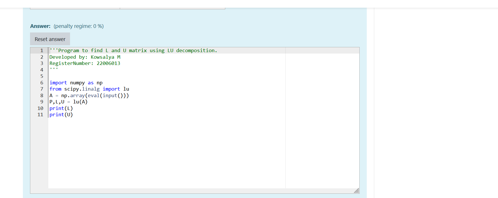
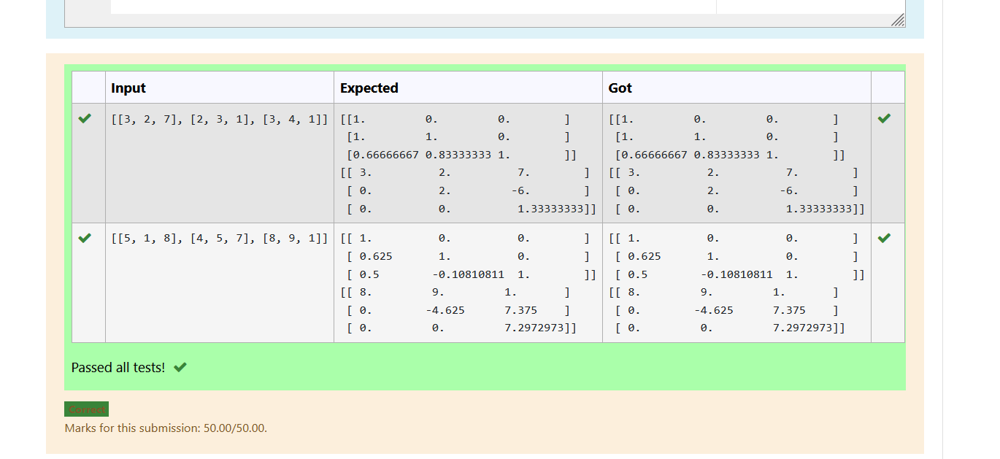
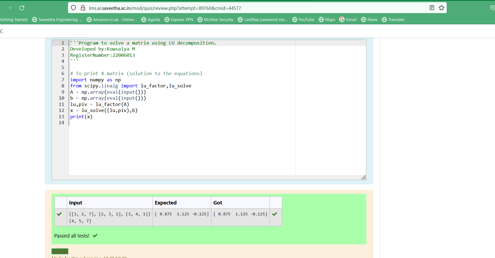

# LU Decomposition 

## AIM:
To write a program to find the LU Decomposition of a matrix.

## Equipments Required:
1. Hardware – PCs
2. Anaconda – Python 3.7 Installation / Moodle-Code Runner

## Algorithm
1. Import the numpy package as np
2. From scipy package import lu
3. Get input from user 
4. print result 

## Program:
(i) To find the L and U matrix
```
/*
Program to find the L and U matrix.
Developed by:Kowsalya M 
RegisterNumber:22006013 
import numpy as np
from scipy.linalg import lu
A = np.array(eval(input()))
P,L,U = lu(A)
print(L)
print(U) 
*/
```
(ii) To find the LU Decomposition of a matrix
```
/*
Program to find the LU Decomposition of a matrix.
Developed by:Kowsalya M 
RegisterNumber:22006013 
import numpy as np
from scipy.linalg import lu
A = np.array(eval(input()))
P,L,U = lu(A)
print(L)
print(U) 
*/
```

## Output: 






## Result:
Thus the program to find the LU Decomposition of a matrix is written and verified using python programming.

